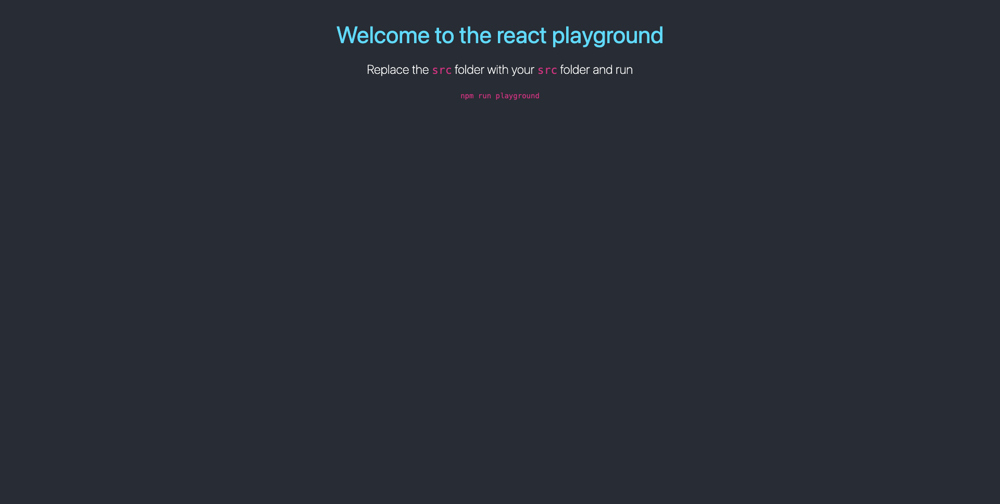

# FED React Course

## Table of Content

- [Create Project Workspace](#1-create-project-workspace)
- [Setup your SSH Keys](#2-setup-your-ssh-keys)
- [Fork Instructor Repository Setup](#3-fork-instructor-repository-setup)
- [NodeJS Installation](#4-nodejs-installation)
- [Getting Started](#5-getting-started)
- [Running the playground](#6-running-the-playground)
- [Course Curriculum](#7-course-curriculum)

### 1. Create Project Workspace

This workspace is a folder which will contain multiple **projects/repositories**.

You will always navigate to this folder in your **terminal** when you start class.

If you want to create a **new project** you will do that in this workspace.

**DO NOT** create projects outside this folder as it is good to keep all your projects organised within a dedicated workspace.

```
cd
mkdir coding_bootcamp
cd coding_bootcamp
```

- `cd` will change the directory to your home directory (Windows/MAC home directory)
- `mkdir coding_bootcamp` will make a directory (folder) called _coding_bootcamp_ in your home directory since you are currently in your home directory because of the previous command
- `cd coding_bootcamp` will change the directory to the newly created directory _coding_bootcamp_ since you created the directory in the previous command

---

### 2. Setup your SSH Keys

If you do not have your SSH keys setup for GitHub please follow the [GITHUB_SSH_SETUP.md](./docs/GITHUB_SSH_SETUP.md) guide

---

### 3. Fork Instructor Repository Setup

**Step 1:**

Fork the instructor repo [here](https://github.com/Purple-Beard/fed-react-course) by following the instructions in GitHub.

**Step 2:**

Navigate in to your project workspace by tying the following command in the terminal:

```
cd ~/coding_bootcamp
```

The above command will take you to your home directory and then navigate to the _coding-bootcamp_ directory irrespective of which directory you are currently in.

**Step 3:**

Clone the forked instructor repository on to your local machine

```
git clone <SSH_LINK_TO_YOUR_FORKED_REPO>
cd <YOUR_FORKED_REPO>
code .
```

- The above git command will clone the project from GitHub using the _ssh link_ provided
- Navigate in to the newly cloned git project
- `code .` will open the project in _Visual Studio Code_

**NOTE:** If `code .` does not work please follow the instructions [here](https://code.visualstudio.com/docs/setup/mac#_launching-from-the-command-line)

---

### 4. NodeJS Installation

Run the command `node --version` in your terminal and if a valid node version is displayed you can skip this step.

If you do not have NodeJS setup on your machine please follow the steps for MacOS or Windows:

#### MacOS installation using NVM

- Open your terminal. NOTE: you can open your terminal from the Spotlight tool by searching for Terminal or you can open your terminal from the Applications folder)
- Paste this command in your terminal and hit Enter `curl -o- https://raw.githubusercontent.com/nvm-sh/nvm/v0.39.3/install.sh | bash`
- The above command will download Node Version Manager (NVM) or update NVM if you already have it installed
- Enter the command `nvm install --lts` which will download the Long-Term Support (stable) version of NodeJS and set it as your default NodeJS version
- NOTE: You might see an error `command not found: nvm` and this is because the terminal application does not recognise the command `nvm` even though you have installed it. Close your terminal and re-open it and type `nvm --version` and if you still get the same error then add the following lines of code to your `~/.zshrc` file if it exists. If the file does not exist then `touch ~/.zshrc` which will create the file. Open the file and copy and paste the code snippet below which will instruct your terminal on how to run the `nvm` commands when you type it in the terminal:

```
export NVM_DIR="$HOME/.nvm"
[ -s "$NVM_DIR/nvm.sh" ] && \. "$NVM_DIR/nvm.sh"  # This loads nvm
[ -s "$NVM_DIR/bash_completion" ] && \. "$NVM_DIR/bash_completion"  # This loads nvm bash_completion
```

- Enter the command `node --version` which will print out the current version of NodeJS (should be something like 18.x.x)
- All done!!

#### Windows installation using installer

- Go the [downloads page](https://nodejs.org/en/download/)
- Select the LTS version and select 32-bit or 64-bit according to your laptop specifications and download the windows installer version
- Once the download is complete follow the steps from the installer
- After the installation is successful, open your terminal and enter the command `node --version` which will print out the current version of NodeJS (should be something like 18.x.x)
- All done!!

### 5. Getting Started

Navigate in to your locally forked repository and install the dependencies for the react playground and run the playground. Please note that `npm run init` is a custom script that installs all the dependencies required by React in the `playground` directory.

```
cd ~/coding_bootcamp/fed-react-course
npm run init
npm run playground
```

You should see a webpage open in your default browser on http://localhost:3000/ like this



### 6. Running the playground

- Replace the `/src` directory in the `/playground` folder with the `/src` directory from either the challenges or the concepts (depending on what you want to run in the playground)
- Open your terminal and make sure you are in the root directory of the react-training project (entry directory of this repository)
- Run the following command in the terminal `npm run playground` and you should see your React application open in http://localhost:3000/
- If you want to stop the playground, in the terminal press (CTRL + C)

### 7. Course Curriculum

> You can find the lesson plans [here](./docs/LESSON_PLANS.md)

> You can find your final project specifications [here](./docs/PROJECT_SPECIFICATIONS.md)
